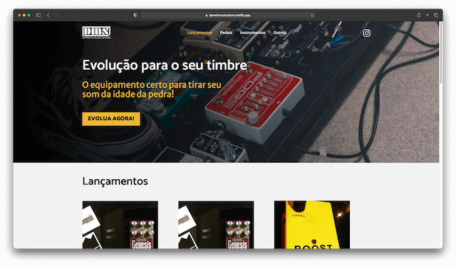
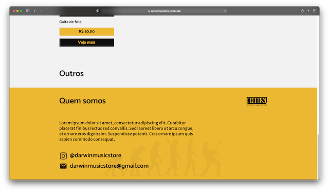
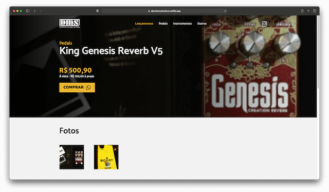
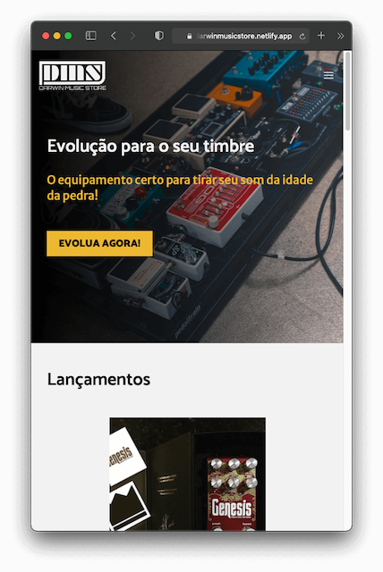
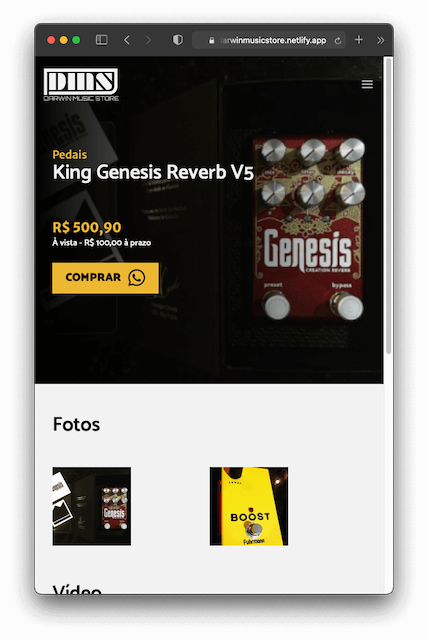

<p align="center">
  
</p>

<h1 align="center">DMS E-commerce 🎸</h1>
<p>
  
  <a href="#" target="_blank">
    
  </a>
</p>

> Darwin Music Store, E-commerce created with React.js, Next.js, Tailwind CSS and Netilify CMS.

### 🏠 [Homepage](https://github.com/luizfverissimo/dms-ecommerce)

### ✨ [Demo](https://darwinmusicstore.netlify.app/)

## Screenshots
  <br>
 

## Install

```sh
yarn # npm install
```

## Usage

```sh
yarn dev # npm run dev
```

## Author

👤 **LF Verissimo**

* Website: https://lfverissimo.com
* Github: [@luizfverissimo](https://github.com/luizfverissimo)
* LinkedIn: [@lfverissimo](https://linkedin.com/in/lfverissimo)

## Show your support

Give a ⭐️ if this project helped you!

***
_This README was generated with ❤️ by [readme-md-generator](https://github.com/kefranabg/readme-md-generator)_